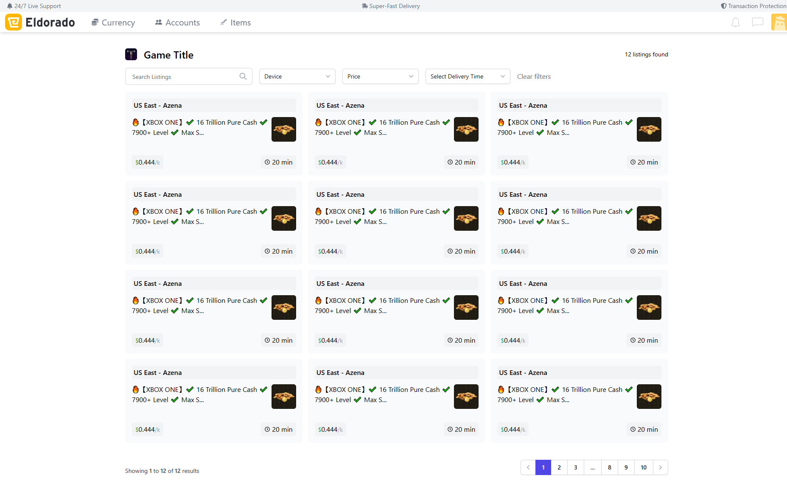

  <h2>Marketcore - Dynamic BST Marketplace Application</h2>
  
A fully-featured buy sell trade marketplace application. Made with the MERN Stack.

  
WIP by <a href="https://cadogy.com">Cadogy</a>

<video autoplay loop muted controls="false" style="width: 100%; height: auto;">
    <source src="mc-menu-demo.mp4" type="video/mp4">
</video>

## Technologies

This project is 🔋 packed with:

- ⚡️ Next.js 13
- ⚛️ React 18
- ✨ TypeScript
- 💨 Tailwind CSS 3 — Configured with CSS Variables to extend the **primary** color
- 💎 Pre-built Components — Components that will **automatically adapt** with color
- 🃏 Jest — Configured for unit testing
- 📈 Absolute Import and Path Alias — Import components using `@/` prefix
- 📏 ESLint — Find and fix problems in your code, also will **auto sort** imports
- 💖 Prettier — Format code consistently
- 🐶 Husky & Lint Staged — Run scripts on staged files before they are committed
- ⏰ Release Please — Generate changelog by activating the `release-please` workflow
- 👷 Github Actions — Lint code on PR
- 🚘 Automatic Branch and Issue Autolink — Branch will be automatically created on issue **assign**, and auto linked on PR
- 🔥 Snippets — A collection of useful snippets
- 👀 Default Open Graph — Awesome open graph generated
- 🗺 Site Map — Automatically generate sitemap.xml
- 📦 Expansion Pack — Easily install common libraries, additional components, and configs
